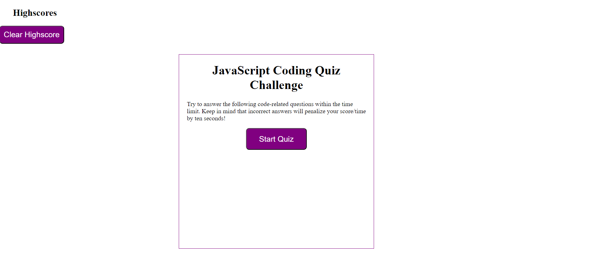

# javascript-quiz

## Description

This website is a timed quiz to test the level of users knowledge in javascript. Quiz contains 5 questions related to javascript and user has overall 60 seconds to finish the quiz. Also, Everytime the question is answered incorrectly it will deduct 10seconds from overall left time. App will save the previous results.

## Installation

N/A

## Usage
To Start a quiz, user presses START button, were they are introduced to the first question with 4 answer choices. 

If answered correctly screen will display correct and will take you to next question.

If answered incorrectly screen will display wrong! Then answer is "correct answer", It will deduct 10 seconds from left time if answered incorrectly. 

If all questioned are answered within the time frame the final score will be leftover timer amount, if the timer runs out before finishing all question or answering all question incorrectly, user will receive 0 points. 

After user will see a screen where they can save their initials and score. 

Deployed site/Website URL: 

## Credits

Used module 4 mini project as a reference. 

Used the following example to build a quiz app: 
https://codingartistweb.com/2022/06/quiz-app-with-javascript/

## License

Please refer to the LICENSE in the repo.